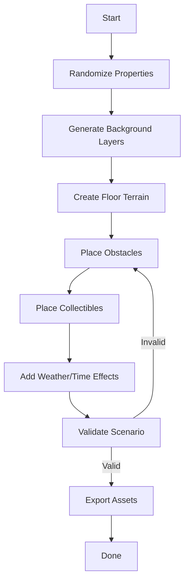

# **SKILL: Procedural Scenario & Background Generator**

**Objective**:
Procedural generation system** that creates unique background graphics and scenarios for a 2D 
platformer/pixel game. This document defines the **criteria, rules, and algorithms** for generating 
consistent yet varied scenarios while ensuring gameplay constraints (e.g., gravity, obstacles, 
collectibles).

## **1. Core Requirements**
All generated scenarios **must** include:
| Property               | Description                                                           | Example Values                              |
|------------------------|-----------------------------------------------------------------------|---------------------------------------------|
| **Floor**              | Solid, traversable ground for the player. Must span the entire width. | Grass, sand, concrete, ice                  |
| **Gravity**            | Constant downward force (Earth-like).                                 | `9.8 m/s²` (scaled for game feel)           |
| **Player Spawn Point** | Safe starting location on the floor.                                  | `(x=100, y=floor_y - player_height)`        |
| **Camera Boundaries**  | Limits to prevent the player from leaving the scenario.               | `left=0, right=width, top=0, bottom=height` |
| **Exit/Goal**          | A reachable endpoint (e.g., door, flag).                              | "Wooden Door", "Portal"                     |

---

## **2. Environmental Properties**
Scenarios are generated by combining **randomized but constrained** properties from the following 
categories. Each category has **weights** to control frequency.

### **A. Time of Day**
| Option   | Weight | Visual Effects                          | Gameplay Impact                   |
|----------|--------|-----------------------------------------|-----------------------------------|
| Day      | 0.5    | Bright colors, shadows beneath objects  | No visibility penalties           |
| Night    | 0.3    | Darker palette, ambient lighting        | Reduced visibility (add torches?) |
| Dawn/Dusk| 0.2    | Gradient sky, long shadows              | Slight visibility reduction       |

### **B. Climate/Weather**
| Option   | Weight | Visual Effects                          | Gameplay Impact                   |
|----------|--------|-----------------------------------------|-----------------------------------|
| Sunny    | 0.4    | Clear sky, bright colors                | None                              |
| Rainy    | 0.3    | Rain particles, puddles on floor        | Slippery floor (reduced friction) |
| Foggy    | 0.2    | Reduced visibility, muted colors        | Limited sight range               |
| Snowy    | 0.1    | Snowfall, ice patches on floor          | Slippery + cold (HP drain?)       |

### **C. Location Type**
| Option   | Weight | Floor Material | Background Assets             | Obstacles                  |
|----------|--------|----------------|-------------------------------|----------------------------|
| Forest   | 0.3    | Grass/Dirt     | Trees, logs, bushes           | Falling branches, roots    |
| City     | 0.3    | Concrete       | Buildings, streetlights, cars | Potholes, scaffolding      |
| Desert   | 0.2    | Sand           | Cacti, rocks, pyramids        | Quick sand, tumbleweeds    |
| Mountain | 0.1    | Rock/Ice       | Cliffs, snow peaks            | Avalanches, icy platforms  |
| Cave     | 0.1    | Stone          | Stalactites, glow mushrooms   | Bats, collapsing floors    |

### **D. Obstacles**
Obstacles are placed on the **floor** or in the **air** with constraints:
- **Floor Obstacles** (must be jumpable or avoidable):
  - Pits, spikes, slippery ice, moving platforms.
- **Air Obstacles** (must be dodgeable):
  - Falling rocks, swinging blades, flying enemies.

**Placement Rules**:
1. **Density**: 1 obstacle per `100–300 pixels` (adjust for difficulty).
2. **Pattern**: Avoid clustering (use Poisson disk sampling).
3. **Fairness**: Always provide a visible path.

### **E. Collectibles**
| Type      | Weight | Placement Rules                          | Effect                          |
|-----------|--------|------------------------------------------|---------------------------------|
| Fruit     | 0.5    | On platforms or floating                 | Restore health                  |
| Coin      | 0.3    | Hidden in obstacles or hard-to-reach     | Score multiplier                |
| Power-Up  | 0.2    | Rare, guarded by obstacles               | Temporary invincibility/speed   |

**Constraints**:
- Minimum `1 collectible per 200 pixels`.
- At least `1 power-up per level`.

---

## **3. Procedural Generation Algorithms**
### **A. Background Layer Generation**
1. **Sky Gradient**:
   - Blend colors based on `time_of_day` (e.g., day=`#87CEEB`, night=`#000033`).
   - Add stars/moon (night) or sun (day).

2. **Parallax Layers**:
   - **Far Layer**: Mountains/clouds (slow scroll).
   - **Mid Layer**: Trees/buildings (medium scroll).
   - **Near Layer**: Foreground details (fast scroll, e.g., bushes).

3. **Weather Effects**:
   - **Rain/Snow**: Particle system (small white/blue sprites falling).
   - **Fog**: Semi-transparent overlay with noise.

### **B. Floor & Terrain Generation**
1. **Base Floor**:
   - Flat or slightly uneven (Perlin noise for hills).
   - Material depends on `location_type`.

2. **Obstacle Placement**:
   - Use **Poisson disk sampling** to avoid overlap.
   - Example (pseudocode):
     ```python
     def place_obstacles(width, height, density=0.01):
         grid = [[False for _ in range(width)] for _ in range(height)]
         active_list = []
         # Start with a random point
         start_x, start_y = random.randint(0, width), height - 10  # Near floor
         active_list.append((start_x, start_y))
         grid[start_y][start_x] = True

         while active_list:
             x, y = active_list.pop(random.randint(0, len(active_list)-1))
             for _ in range(30):  # Try 30 new points
                 angle = random.uniform(0, 2 * math.pi)
                 distance = random.uniform(10, 30)
                 nx, ny = x + distance * math.cos(angle), y + distance * math.sin(angle)
                 if (0 <= nx < width and 0 <= ny < height and
                     not grid[int(ny)][int(nx)] and
                     distance_to_nearest(grid, nx, ny) > 10):
                     grid[int(ny)][int(nx)] = True
                     active_list.append((nx, ny))
                     place_obstacle_at(nx, ny)  # e.g., spike, pit
         return grid
     ```

### **C. Collectible Placement**
- **Fair Distribution**:
  - Use a **grid-based approach** to ensure collectibles are reachable.
  - Example: Place 1 collectible per "safe zone" (area without obstacles).
- **Power-Ups**:
  - Hide behind challenges (e.g., after a jump puzzle).

### **D. Scenario Validation**
Before finalizing, check:
1. **Path Exists**: A* pathfinding from spawn to exit.
2. **Difficulty Balance**:
   - Obstacle density ≤ `max_density` (e.g., 0.2).
   - No unsolvable traps (e.g., spikes with no escape).
3. **Visual Variety**: No repeated patterns in backgrounds.

---

## **4. Agent Workflow**
The agent follows this pipeline to generate a scenario:


### **Step-by-Step Code Outline (Pseudocode)**
```python
class ScenarioGenerator:
    def __init__(self, width, height):
        self.width = width
        self.height = height
        self.properties = self._randomize_properties()
        self.layers = {
            "sky": None,
            "far": None,
            "mid": None,
            "near": None,
            "floor": None,
            "obstacles": [],
            "collectibles": []
        }

    def _randomize_properties(self):
        return {
            "time_of_day": weighted_random(["day", "night", "dawn"], [0.5, 0.3, 0.2]),
            "climate": weighted_random(["sunny", "rainy", "foggy", "snowy"], [0.4, 0.3, 0.2, 0.1]),
            "location": weighted_random(["forest", "city", "desert", "mountain", "cave"], [0.3, 0.3, 0.2, 0.1, 0.1]),
        }

    def generate(self):
        self._generate_background()
        self._generate_floor()
        self._place_obstacles()
        self._place_collectibles()
        self._apply_weather()
        if not self._validate():
            return self.generate()  # Retry if invalid
        return self._export()

    def _generate_background(self):
        # Create sky gradient based on time_of_day
        self.layers["sky"] = create_gradient(
            color1=TIME_OF_DAY_COLORS[self.properties["time_of_day"]][0],
            color2=TIME_OF_DAY_COLORS[self.properties["time_of_day"]][1]
        )
        # Add parallax layers (far/mid/near)
        ...

    def _place_obstacles(self):
        density = 0.01 + (0.05 if self.properties["climate"] == "rainy" else 0)
        obstacle_types = OBSTACLES_BY_LOCATION[self.properties["location"]]
        poisson_points = poisson_disk_sampling(self.width, self.height, density)
        for x, y in poisson_points:
            obstacle = random.choices(
                obstacle_types,
                weights=[o["weight"] for o in obstacle_types]
            )[0]
            self.layers["obstacles"].append({"type": obstacle, "x": x, "y": y})

    def _validate(self):
        # Check path from spawn to exit
        spawn = (100, self.height - 50)
        exit = (self.width - 50, self.height - 50)
        return a_star_path_exists(self.layers["obstacles"], spawn, exit)

    def _export(self):
        return {
            "background": combine_layers(self.layers),
            "obstacles": self.layers["obstacles"],
            "collectibles": self.layers["collectibles"],
            "properties": self.properties
        }
```

---

## **5. Example Outputs**
### **Scenario 1: "Sunny Forest Day"**
- **Properties**:
  - Time: Day
  - Climate: Sunny
  - Location: Forest
- **Visuals**:
  - Sky: Light blue gradient.
  - Far Layer: Distant trees.
  - Floor: Grass with occasional roots.
- **Obstacles**:
  - Falling branches (air).
  - Pits (floor).
- **Collectibles**:
  - Apples (on platforms).
  - Mushrooms (hidden in bushes).

### **Scenario 2: "Foggy City Night"**
- **Properties**:
  - Time: Night
  - Climate: Foggy
  - Location: City
- **Visuals**:
  - Sky: Dark purple with fog overlay.
  - Mid Layer: Silhouettes of buildings.
- **Obstacles**:
  - Potholes (floor).
  - Swinging street signs (air).
- **Collectibles**:
  - Coins (on lampposts).
  - Coffee cup (power-up for speed).

---

## **6. Extensions (Advanced)**
1. **Biome-Specific Mechanics**:
   - **Desert**: Heat waves distort visibility.
   - **Cave**: Darkness (only lit areas are safe).
2. **Procedural Music**:
   - Generate chiptune melodies matching the scenario’s mood (e.g., eerie for caves).
3. **Dynamic Difficulty**:
   - Adjust obstacle density based on player skill (track deaths/retries).
4. **LLM-Assisted Generation**:
   - Use prompts like:
     ```
     "Describe a unique obstacle for a {location} level in a pixel platformer.
     Return as JSON: {'name': ..., 'description': ..., 'sprite': ..., 'behavior': ...}"
     ```

---

## **7. Tools & Libraries**
| Task               | Recommended Tools                               |
|--------------------|-------------------------------------------------|
| Procedural Noise   | `noise`, `PerlinNoise` (Python)                 |
| Poisson Sampling   | Custom implementation or `scipy.spatial`        |
| Rendering          | `Pygame`, `Pillow` (for asset export)           |
| Pathfinding        | `A*` algorithm (custom or `python-pathfinding`) |
| Weather Effects    | Particle systems (custom shaders in Pygame)     |

---

## **8. Validation Metrics**
| Metric              | Target Value | How to Measure                     |
|---------------------|--------------|------------------------------------|
| Playability         | 100%         | A* path exists from spawn to exit. |
| Obstacle Density    | 10–20%       | `(obstacle_pixels / total_pixels)` |
| Collectible Balance | 1 per 200px  | Count collectibles / level width.  |
| Visual Variety      | ≥3 unique    | Count distinct background assets.  |

---

## **9. Failure Handling**
If generation fails validation:
1. **Retry**: Regenerate with adjusted parameters (e.g., reduce obstacle density).
2. **Fallback**: Use a predefined "safe" scenario.
3. **Log Issues**: Track common failures (e.g., "no path" errors) for debugging.

---

## **10. Example JSON Output**
```json
{
  "properties": {
    "time_of_day": "night",
    "climate": "foggy",
    "location": "city",
    "difficulty": 0.7
  },
  "background": {
    "sky": {"gradient": ["#000033", "#1a1a40"]},
    "far": {"assets": ["building_silhouette.png"], "speed": 0.2},
    "fog": {"density": 0.5, "color": "#333333"}
  },
  "floor": {
    "material": "concrete",
    "heightmap": [0, 0, 0, 1, 1, 0, ...]  // 0=flat, 1=bump
  },
  "obstacles": [
    {"type": "pothole", "x": 300, "y": 450, "width": 30, "height": 10},
    {"type": "swinging_sign", "x": 500, "y": 200, "amplitude": 20}
  ],
  "collectibles": [
    {"type": "coin", "x": 400, "y": 300, "value": 10},
    {"type": "powerup", "x": 700, "y": 100, "effect": "speed_boost"}
  ],
  "entities": {
    "player_spawn": {"x": 100, "y": 400},
    "exit": {"x": 800, "y": 400, "type": "door"}
  }
}
```

---
**Final Notes**:
- Start with **simple rules** (e.g., flat floor + basic obstacles) before adding complexity.
- Use **seeds** for reproducibility (`random.seed(seed)`).
- Test scenarios manually to refine weights and constraints.

This `SKILL.md` provides a **complete blueprint** for an agent to generate infinite, unique, and fair scenarios. Adjust weights and rules to match your game’s design! 🚀