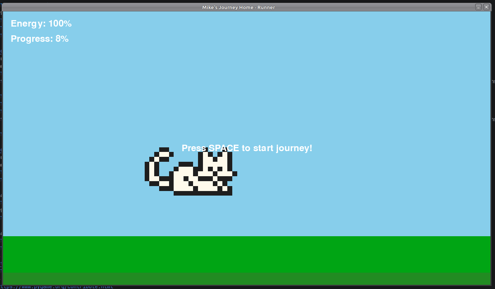

# Mike's Journey Home - Pixel Art Game

A procedural pixel art game where Mike the cat travels home through various cities.

## Overview

This project generates pixel art sprites and game levels using AI (LLM) and displays them in a Pygame window. The game features:

- **AI-Generated Pixel Art**: Uses Mistral AI to generate 16x16 pixel sprites
- **Procedural Level Generation**: Creates game levels based on city themes
- **Pygame Rendering**: Displays sprites and game elements

## Running the Demo



### Prerequisites

- Python 3.10+
- uv package manager
- Mistral AI API key (optional for mock mode)

### Installation

```bash
uv sync
```

### Running the Demo

```bash
PYTHONPATH=. uv run python src/demo.py
```

This will generate a "red apple" pixel art sprite and save it as `apple.png`.

### Running the Sprite Demo

```bash
PYTHONPATH=. uv run python src/demo_sprites.py
```

This will generate grass and water tiles using the LLM and display them in a Pygame window.

### Running the Mock Sprite Demo

```bash
PYTHONPATH=. uv run python src/demo_sprites_mock.py
```

This displays mock tiles without requiring LLM calls.

## Configuration

Create a config file at `~/.mikes_game/config.toml`:

```toml
[mistral]
api_key = "your-mistral-api-key"

[game]
difficulty = "medium"
starting_city = "Tokyo"
```

## Project Structure

```
mistral-game/
├── src/
│   ├── demo.py                # Main demo script
│   ├── demo_sprites.py        # Sprite generation demo
│   ├── demo_sprites_mock.py   # Mock sprite demo
│   ├── llm.py                 # LLM integration
│   ├── config.py              # Configuration
│   ├── generate_tile.py       # Tile generation
│   └── pcg.py                 # Procedural generation
├── sprites/                   # Sprite assets
├── config.toml                # Default config
└── README.md                 # This file
```

## Features

- **AI-Powered Pixel Art**: Generate 16x16 sprites with RGB/RGBA support
- **City-Based Levels**: Generate levels for different cities (Tokyo, New York, etc.)
- **Pygame Integration**: Display and interact with generated content
- **Mock Mode**: Run demos without API keys

## Recent Changes

- Fixed LLM response handling to support both string and list responses
- Added RGB to RGBA conversion for pixel art
- Improved error handling for invalid pixel data

## License

MIT
